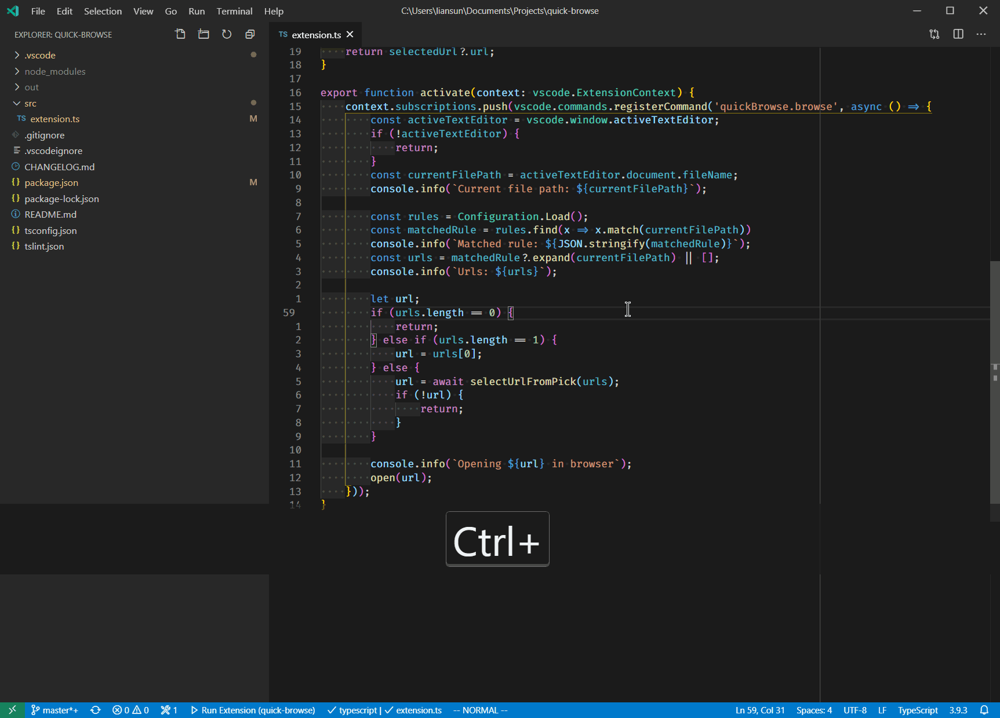

# Introduction
## This extension enables you open the current file in browser based on the file path.



# Settings
## Here is an example to enable this project (under the quick-browse) to quick browse the files in github (default keyboard shortcut `Ctrl+Alt+B`).

```json
"quickBrowse.rules": [
    {
        "pattern": ".+?/quick-browse/(.*)",
        "list": [
            "https://github.com/sunliangqin/VSCodeQuickBrowse/blob/master/$1"
        ]
    }
]
```
1. pattern: a regular expression to match the current file path (use '/' as path separator). The first rule that matches will be used for quick browse.
1. list: a list of url for quick browse. Use $n to reference the capturing groups defined in pattern.